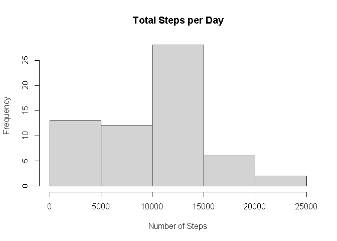
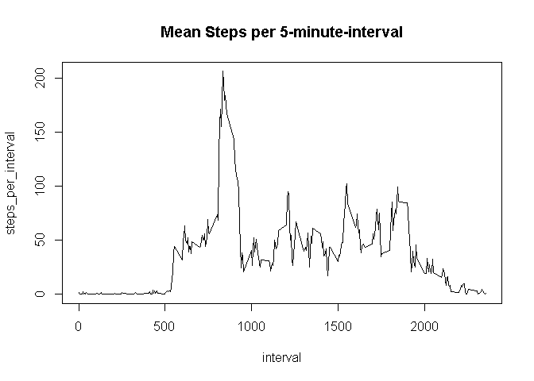
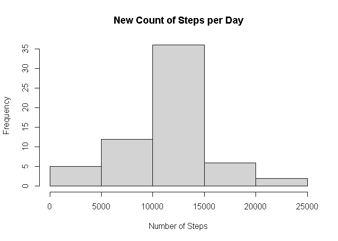
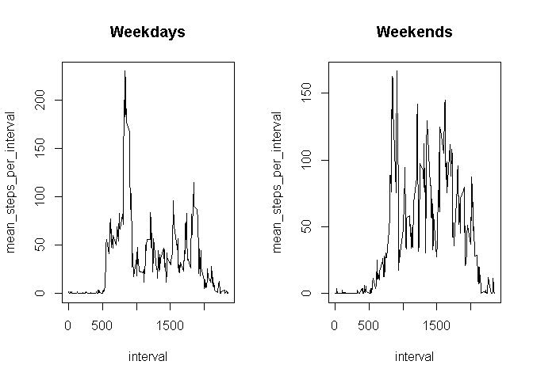

## Loading and preprocessing the data


```r
table <- read.csv("C:/Users/Andrew Hsu/OneDrive/Desktop/Aquarium/IT/R/repdata_data_activity/activity.csv")
```

## What is mean total number of steps taken per day?

In this part of the assignment, the missing values are ignored.

1. Calculate the total number of steps taken per day


```r
steps_per_day <- with(table, tapply(steps, date, sum, na.rm = T))
```

2. Make a histogram of the total number of steps taken each day


```r
steps_per_day <- data.frame(steps_per_day)
steps_per_day <- cbind(date = rownames(steps_per_day), steps_per_day)
rownames(steps_per_day) <- 1:nrow(steps_per_day)
class(steps_per_day$date) <- "date"
hist(steps_per_day$steps_per_day, main = "Total Steps per Day", xlab = "Number of Steps")
```

<!-- -->

3. Calculate and report the mean and median of the total number of steps taken per day


```r
mean(steps_per_day$steps_per_day, na.rm = T)
```

```
## [1] 9354.23
```

```r
median(steps_per_day$steps_per_day, na.rm = T)
```

```
## [1] 10395
```

## What is the average daily activity pattern?

1. Make a time series plot of the 5-minute interval and the average number of steps taken, averaged across all days


```r
steps_per_interval <- with(table, tapply(steps, interval, mean, na.rm = T))
steps_per_interval <- data.frame(steps_per_interval)
steps_per_interval <- cbind(interval = rownames(steps_per_interval), steps_per_interval)
rownames(steps_per_interval) <- 1:nrow(steps_per_interval)
with(steps_per_interval, plot(interval, steps_per_interval, type = "l", main = "Mean Steps per 5-minute-interval"))
```

<!-- -->

2. Which 5-minute interval, on average across all the days in the dataset, contains the maximum number of steps?


```r
steps_per_interval[which.max(steps_per_interval$steps_per_interval), ]
```

```
##     interval steps_per_interval
## 104      835           206.1698
```

## Imputing missing values

1. Calculate and report the total number of missing values in the dataset


```r
sum(is.na(table))
```

```
## [1] 2304
```

2. Devise a strategy for filling in all of the missing values in the dataset


```r
table[is.na(table)] <- round(steps_per_interval$steps_per_interval)
```

3. Make a histogram of the total number of steps taken each day and Calculate and report the mean and median total number of steps taken per day


```r
new_steps_per_day <- with(table, tapply(steps, date, sum))
new_steps_per_day <- data.frame(new_steps_per_day)
new_steps_per_day <- cbind(date = rownames(new_steps_per_day), new_steps_per_day)
rownames(new_steps_per_day) <- 1:nrow(new_steps_per_day)
with(new_steps_per_day, hist(new_steps_per_day, main = "New Count of Steps per Day", xlab = "Number of Steps"))
```

<!-- -->

## Are there differences in activity patterns between weekdays and weekends?

1. Create a new factor variable in the dataset with two levels – “weekday” and “weekend” indicating whether a given date is a weekday or weekend day


```r
table$date <- as.Date(table$date)
table$day <- weekdays(table$date, abbr = T)
```

2. Make a panel plot containing a time series plot of the 5-minute interval and the average number of steps taken, averaged across all weekday days or weekend days


```r
weekday_table <- subset(table, day %in% c("Mon", "Tue", "Wed", "Thu", "Fri"))
weekend_table <- subset(table, day %in% c("Sat", "Sun"))
weekday_table <- with(weekday_table, tapply(steps, interval, mean))
weekday_table <- data.frame(weekday_table)
weekday_table <- cbind(interval = rownames(weekday_table), weekday_table)
rownames(weekday_table) <- 1:nrow(weekday_table)
colnames(weekday_table)[2] <- "mean_steps_per_interval"
weekend_table <- with(weekend_table, tapply(steps, interval, mean))
weekend_table <- data.frame(weekend_table)
weekend_table <- cbind(interval = rownames(weekend_table), weekend_table)
rownames(weekend_table) <- 1:nrow(weekend_table)
colnames(weekend_table)[2] <- "mean_steps_per_interval"
par(mfrow = c(1, 2))
with(weekday_table, plot(interval, mean_steps_per_interval, type = "l", main = "Weekdays"))
with(weekend_table, plot(interval, mean_steps_per_interval, type = "l", main = "Weekends"))
```

<!-- -->
